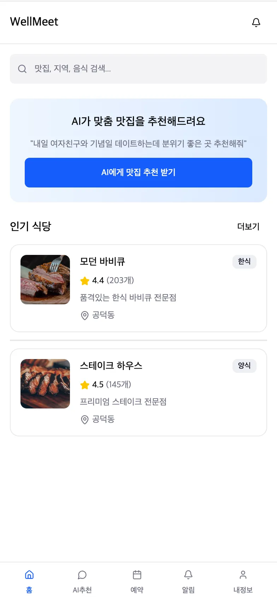
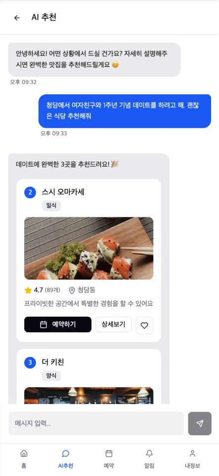
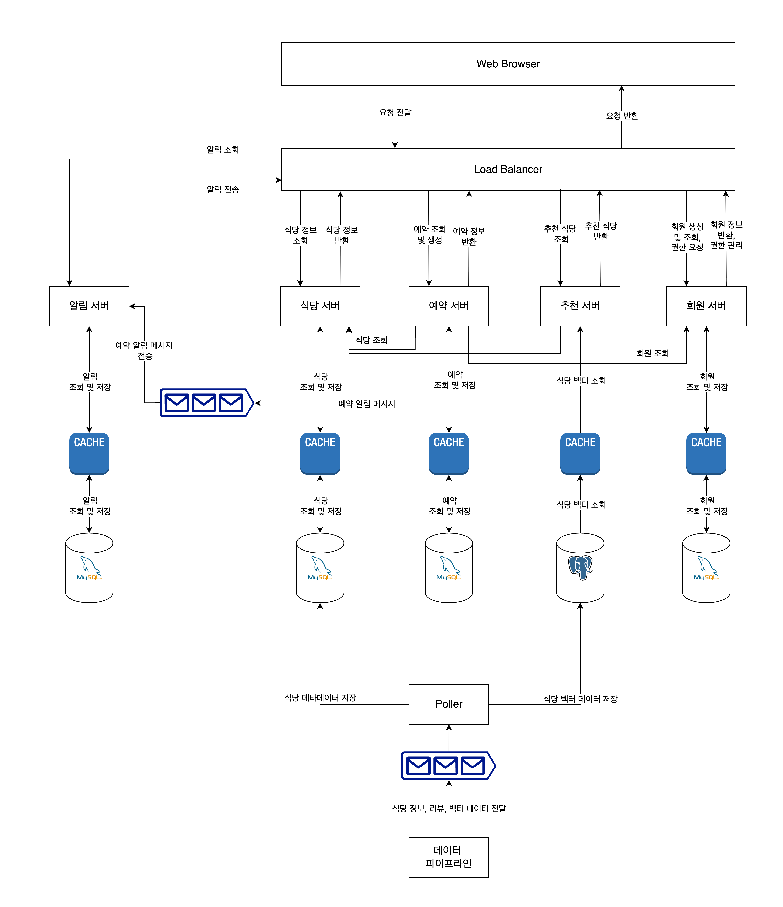
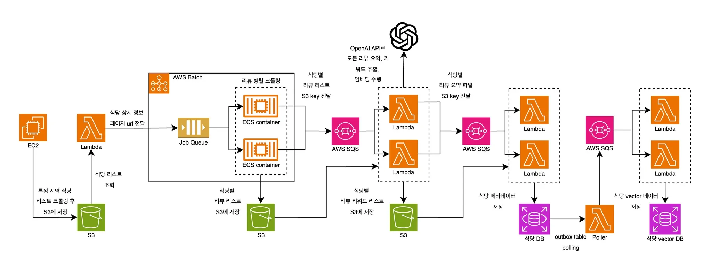

# WellMeet

## 프로젝트 개요

### 프로젝트 소개

**"귀한 손님을 위한 완벽한 한 끼, AI가 찾아드립니다"**

WellMeet은  LLM API와 벡터 데이터베이스를 결합한 AI 검색으로 특별한 손님과의 식사 자리에 최적화된 식당을 자연어(”여자친구와 1주년 기념일에 갈 만한 곳”)로 검색할 수 있는 스마트 검색 기능을 제공하는 서비스입니다.

특별한 손님과의 소중한 시간을 위해 AI가 상황별 최적의 맛집을 찾아주고, 예약까지 원스톱으로 제공하는 프리미엄 다이닝 플랫폼입니다.

### 시스템 구성도

### 주요 기능

### 개발 환경

- Front-end: `TypeScript`, `React.js`
- Back-end: `Java`, `Spring Boot`, `JPA`, `MySQL`, `PostgreSQL`, `AWS`

## 개발 결과물

### 시스템 아키텍처

### 데이터 파이프라인 아키텍처

